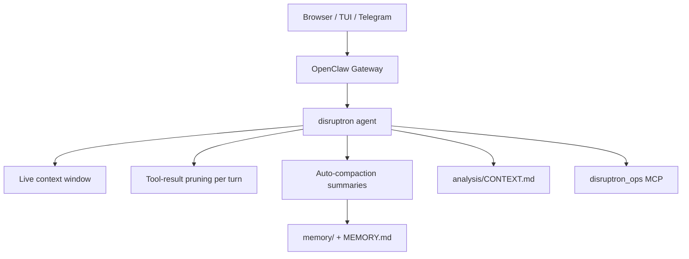

# Context management (Nemotron Omni)

NV-Disruptron runs **Nemotron 3 Nano Omni** via vLLM at the model’s full **256k** context window (`--max-model-len 262144`, matching `llm_config.max_position_embeddings` on Hugging Face). On GB10 (~121GB unified) we allocate **~89% GPU memory** and **`max-num-seqs=1`** so KV cache can use the full window.

## Architecture



| Mechanism | What it does |
|-----------|----------------|
| **256k vLLM window** | Full Nemotron Omni context; matches OpenClaw `contextWindow` |
| **Slim MCP** | 9–12 tools (`DISRUPTRON_SLIM_MCP=true`) — smaller tool schema |
| **Context pruning** | Trims old tool results in-memory before each LLM call |
| **Auto-compaction** | Summarizes older chat turns; keeps recent tail |
| **Memory flush** | Before compaction, agent writes facts to disk |
| **File memory** | `MEMORY.md` + `memory/YYYY-MM-DD.md` — durable, not in every prompt |
| **Analysis artifacts** | `analysis/CONTEXT.md` — compact metrics for next turn |
| **Image downscale** | `DISRUPTRON_IMAGE_MAX_PX=768` — fewer vision tokens |

## Operator commands (Control UI / TUI)

| Command | Action |
|---------|--------|
| `/new` or `/reset` | Fresh session (use when chat hangs on overflow) |
| `/compact` | Force summarization; optional focus text |
| `/context list` | Show what's consuming tokens |
| `/status` | Context usage + compaction count |

## Environment knobs (`.env`)

```bash
# Model window (must match vLLM --max-model-len)
VLLM_MAX_MODEL_LEN=262144
DISRUPTRON_CONTEXT_WINDOW=262144
DISRUPTRON_MAX_OUTPUT_TOKENS=4096

# If OOM on startup, step down:
# VLLM_MAX_MODEL_LEN=131072
# VLLM_GPU_UTIL=0.55
# VLLM_MAX_NUM_SEQS=2

# Compaction
DISRUPTRON_COMPACTION_RESERVE_TOKENS=4096
DISRUPTRON_COMPACTION_KEEP_RECENT=8192
DISRUPTRON_COMPACTION_MAX_HISTORY_SHARE=0.55

# Tool + bootstrap caps
DISRUPTRON_TOOL_RESULT_MAX_CHARS=6000
DISRUPTRON_BOOTSTRAP_MAX_CHARS=4000
DISRUPTRON_MAX_SKILLS_PROMPT_CHARS=4000
DISRUPTRON_IMAGE_MAX_PX=768

# Session hygiene
DISRUPTRON_SESSION_IDLE_MINUTES=120        # new session id after idle
```

Apply after editing:

```bash
./scripts/disruptron vllm --recreate   # when changing VLLM_MAX_MODEL_LEN
./scripts/disruptron configure
openclaw gateway restart
```

## GPU memory tuning (GB10 ~121GB unified)

| `VLLM_MAX_MODEL_LEN` | Default `VLLM_GPU_UTIL` | Default `VLLM_MAX_NUM_SEQS` |
|----------------------|---------------------------|-----------------------------|
| 262144 (256k) | 0.89 | 1 |
| 131072 | 0.55 | 2 |
| 65536 | 0.45 | 4 |
| ≤ 32768 | 0.35 | 4 |

If the container exits on startup, lower `VLLM_MAX_MODEL_LEN` or set `VLLM_GPU_UTIL` explicitly.

## SQLite conversation database (persistent memory)

For **browser**, **Telegram**, and **CLI**, chat continuity is stored outside the live window:

| Store | Path / service |
|-------|----------------|
| Database | `data/disruptron_context.db` |
| REST API | `http://127.0.0.1:8010/v1/context/` (outputs-api) |
| MCP | `disruptron_ops__recall_conversation_context`, `disruptron_ops__store_memory_fact` |

```bash
# After Control UI sessions — import OpenClaw JSONL + compaction summaries
./scripts/disruptron context sync

# Print compact recall for browser chat "main"
./scripts/disruptron context recall browser main

# Stable OpenClaw session id (continues same thread)
./scripts/disruptron context session-id browser main
```

Each row tracks **`channel`**, **`chat_id`**, **`run_id`**, message text, image refs, token counts, and **memory facts**. The agent recalls a **bounded** block (~2800 chars) instead of replaying full history.

Skill: `features/agent/workspace/skills/disruptron-context-memory/SKILL.md`

## Embeddings / semantic memory

OpenClaw supports `memory_search` with embedding providers for long-term recall without stuffing the prompt. For hackathon local-first setup we use **file memory** (`MEMORY.md`, daily notes) plus compaction summaries.

To add semantic search later: enable a memory plugin in OpenClaw and index `memory/` — see [OpenClaw Memory](https://docs.openclaw.ai/concepts/memory).

## Related

- [DEVELOPMENT.md](DEVELOPMENT.md) · [ENGINEERING.md](ENGINEERING.md)
- Workspace: `features/agent/workspace/AGENTS.md` (context rules for the agent)
