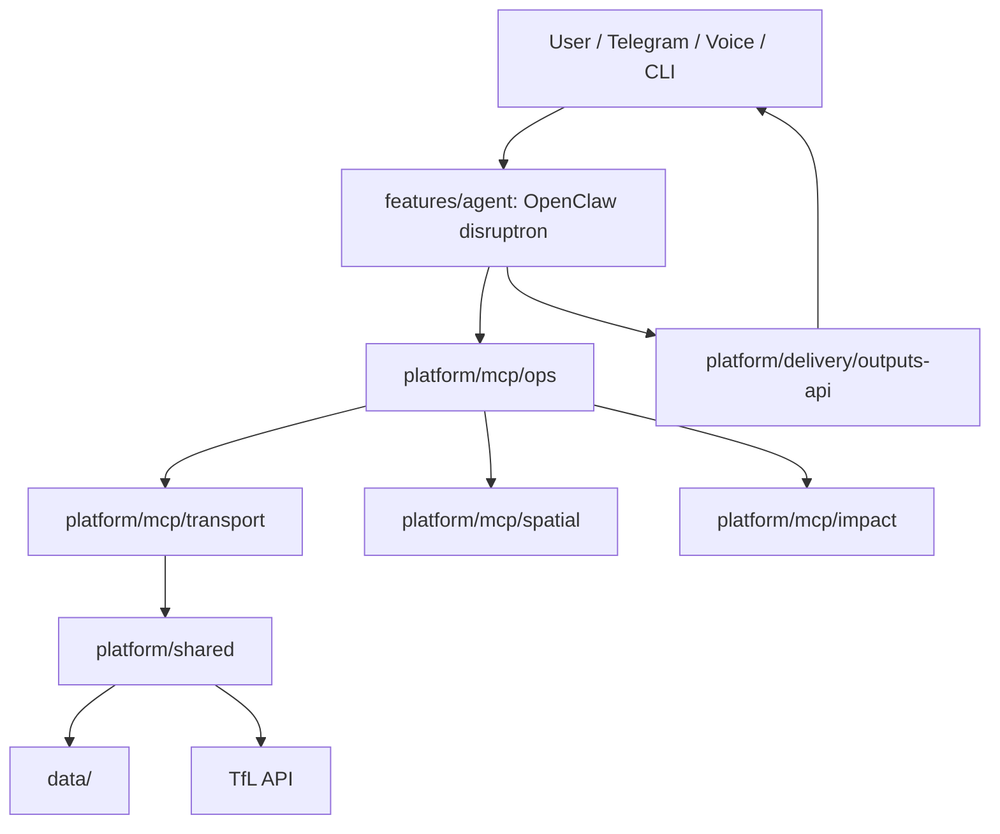

# Project structure

NV-Disruptron separates **product features** (agent runtime) from **platform infrastructure** (MCP, delivery, shared libs).

```
NV-Disruptron-Gyana/
├── features/
│   └── agent/                        # OpenClaw workspace, skills, research, docs
│       ├── workspace/                # AGENTS.md, skills, USER.md, VOICE.md
│       ├── research/                 # optional AI-Q sidecar configs
│       └── docs/
├── platform/
│   ├── mcp/                          # ALL MCP servers
│   │   ├── transport/                # TfL live (~31 tools)
│   │   ├── spatial/                  # wards / IMD
│   │   ├── impact/                   # briefing + equity
│   │   └── ops/                      # slim disruptron_ops (9 tools)
│   ├── delivery/
│   │   ├── outputs-api/              # push API
│   │   └── telegram/
│   ├── data/scripts/                 # prepare_wards.py
│   ├── shared/                       # Python: tfl_client, disruptron_data
│   └── scripts-lib/                  # disruptron CLI modules
├── data/                             # london_wards_imd.csv
├── scripts/disruptron                # single CLI entry
├── docs/
└── [symlinks]                        # mcp/, outputs-api/, shared/, configs/, …
```

## Root symlinks

| Symlink | Target |
|---------|--------|
| `mcp` | `platform/mcp/` |
| `disruptron` | `features/agent/` |
| `outputs-api` | `platform/delivery/outputs-api/` |
| `configs` | `features/agent/research/configs/` |
| `shared` | `platform/shared/` |

MCP packages live only under `platform/mcp/{transport,spatial,impact,ops}`. Use `mcp/spatial` or `platform/mcp/spatial` — not separate root folders per server.

## Data flow



## Conventions

- **MCP servers** → `platform/mcp/<name>/` only
- **Agent runtime** → `features/agent/workspace/`
- **Share logic** via `platform/shared/`, never duplicate across MCPs
- **CLI** → `./scripts/disruptron` (implementation in `platform/scripts-lib/lib/`)

## Related docs

- [platform/mcp/README.md](../platform/mcp/README.md) — MCP catalog
- [platform/README.md](../platform/README.md) — platform overview
- [INDEX.md](INDEX.md) · [ENGINEERING.md](ENGINEERING.md) · [MCP.md](MCP.md)
