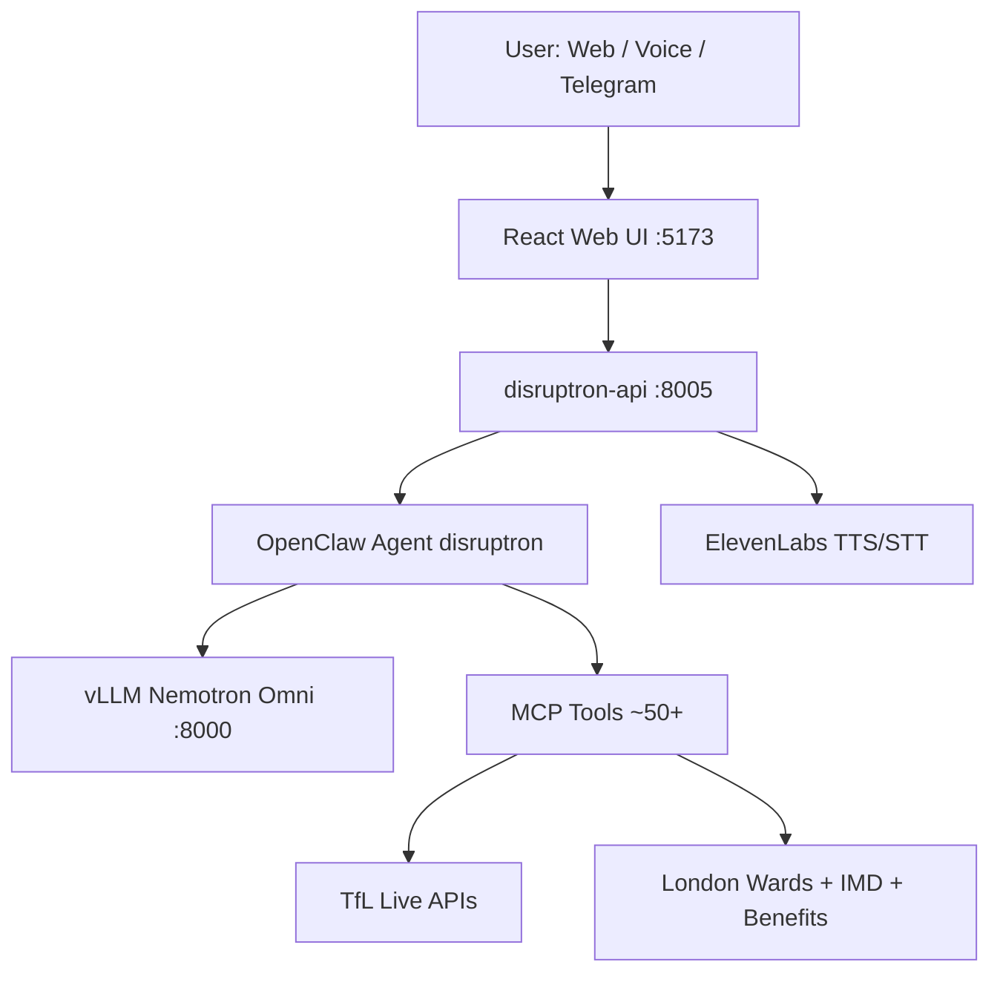
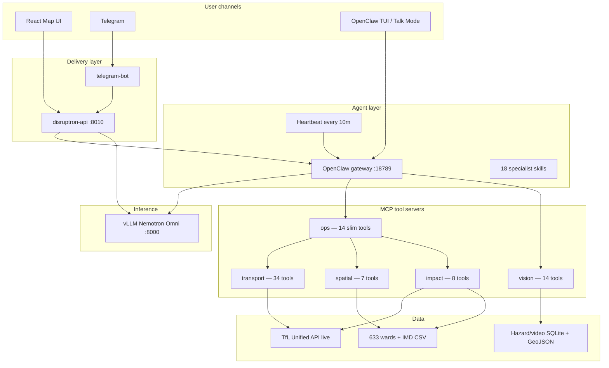

# NVIDIA AI hack project overview
_Exported on 6/18/2026 at 22:03:23 GMT+1 from Cursor (3.7.40)_

---

**User**

/home/aimsgroupuol/AIMSgeneral/Gyanateet/nvidia_ai_hack
@Browser can you understand this project?

---

**Cursor**

I'll explore the Lifeline hackathon project structure and key files to build a clear picture of what it does.


**Composer**

Yes — I read the repo, the `agent_context/` exports, and the [NVIDIA Hack for Impact – London](https://luma.com/NVIDIA-Hack-London) page. Here is the picture.

## What this project is

This is your **NVIDIA Hack for Impact London 2026** workspace. It started as **Lifeline** (multilingual benefits navigator) and pivoted to **NV-Disruptron** — an **autonomous London mobility intelligence agent** that watches live TfL/EV data and alerts you when transport or charging conditions affect *your* commute.

**One-line pitch:**

> NV-Disruptron fuses live TfL disruption data with London ward deprivation and economic open data, so you see not just *where* transport is failing, but *which communities* bear the cost — and what to do next.

**Hackathon fit:** **Urban Operations** (primary), with a Public Services angle for vulnerable wards during disruptions.

---

## How the repo is organized

```
nvidia_ai_hack/
├── README.md              # Original Lifeline scaffold docs
├── lifeline/              # Original benefits agent (still present)
├── data/                  # Benefits rules + City of London open data
├── inputs/                # Session JSON configs
├── scripts/               # serve_nemotron + run_lifeline wrappers
├── agent_context/         # Cursor planning exports (idea evolution)
└── NV-Disruptron/         # ★ Main active project
    ├── platform/mcp/      # MCP servers (transport, spatial, impact, ops)
    ├── features/
    │   ├── agent/         # OpenClaw workspace + USER.md profile
    │   ├── delivery/
    │   │   ├── disruptron-api/   # FastAPI backend (alerts, chat, TTS)
    │   │   └── web/              # React + Vite UI
    │   └── inference/     # vLLM setup
    └── scripts/disruptron # Single CLI entry point
```

There are **two parallel code paths**:

| Path | Purpose | Status |
|------|---------|--------|
| `lifeline/` | Benefits letter understanding, eligibility, nearest services | Scaffolded, original hackathon idea |
| `NV-Disruptron/` | Live transport + equity scoring + 24/7 alerts | **Active main build** |

---

## Architecture



### Four MCP servers (`platform/mcp/`)

| Server | Tools | Role |
|--------|-------|------|
| **Transport** | ~31 | Tube, roads, EV charging, car parks, air quality |
| **Spatial** | 7 | Ward lookup, IMD deprivation, postcodes |
| **Impact** | 7 | Equity scoring, disruption briefings |
| **Ops (slim)** | 9 | Default for 24/7 agent — re-exports key tools |

Key tool: `get_london_city_briefing` — city-wide status in one call.

### Inference

- **Model:** `nvidia/Nemotron-3-Nano-Omni-30B-A3B-Reasoning-FP8` (or NVFP4)
- **Engine:** vLLM on DGX Spark (`spark-1240`, 128 GB unified memory)
- **Design:** Local-first — no cloud LLM keys required; TfL API works anonymously

---

## How to run it

```bash
cd /home/aimsgroupuol/AIMSgeneral/Gyanateet/nvidia_ai_hack/NV-Disruptron

# 24/7 autonomous monitor + alerts
./scripts/disruptron daemon

# Interactive agent (voice + vision)
./scripts/disruptron run

# Start Nemotron backend
./scripts/disruptron vllm --recreate

# Health check
./scripts/disruptron validate
```

**Current state on `spark-1240`:** Nothing is running right now — vLLM (`:8000`), OpenClaw (`:18789`), web UI (`:5173`), and API (`:8005`) are all down.

---

## Web UI (`features/delivery/web/`)

A React app with:

- **Live page** — voice/text chat with Nemotron, neural visualizer, agent UI blocks (route cards, metrics, timelines)
- **Onboarding** — commute lines, areas (E15, EC2), alert preferences
- **Notifications / Summaries** — proactive alerts and daily digests
- **Personalization** — synced to `features/agent/workspace/USER.md`

Example profile: Central + Jubilee lines, E15/EC2 areas, alerts on line disruption and road congestion.

---

## Original Lifeline scaffold (still in repo)

The top-level `lifeline/` package implements a simpler agent loop with three tools:

- `check_benefit_eligibility` — offline UK benefit rules
- `find_nearest_service` — City of London services catalog
- `draft_form_letter` — appeal/application templates

Example session config at `inputs/lifeline_session.example.json` — explain a DWP letter and list eligible benefits.

---

## Idea evolution (from `agent_context/`)

| Phase | Name | Focus |
|-------|------|-------|
| 1 | **Lifeline** | Multilingual benefits navigator — read letters, find help |
| 2 | **LifeLine Grid** | TfL disruptions × ward deprivation × economic impact |
| 3 | **NV-Disruptron** | 24/7 autonomous mobility agent + web UI + voice alerts |

The benefits data under `data/benefits/` and `data/city_of_london/` is still there and could be wired back in via MCP or the original `lifeline/` orchestrator.

---

## Hackathon requirements (confirmed via browser)

From [luma.com/NVIDIA-Hack-London](https://luma.com/NVIDIA-Hack-London):

- **When:** Fri 5 Jun 6pm → Sun 7 Jun 5pm 2026
- **Hardware:** DGX Spark / ZGX Nano (GB10 Grace Blackwell) per team
- **Must use:** Open models + City of London open data + agentic architecture
- **Tracks:** Economic Systems, Public Services, Urban Operations
- **Sponsors:** HP/Scan (hardware), Nebius (cloud), ElevenLabs (voice)

NV-Disruptron checks all boxes: local Nemotron, TfL + IMD + ward data, agentic MCP tool loop, optional ElevenLabs voice.

---

If you want to go deeper, I can start the stack on Spark, walk through the web UI, or trace a single query end-to-end through MCP → Nemotron → response.

---

**User**

can you check what is there rn and what we have implemented instead?

---

**Cursor**

I'll audit the repo against the original plan and report what's actually implemented versus still scaffolded.


Verifying a few key claims against the code before summarizing.


**Composer**

Here is an honest audit of **what was planned** vs **what is actually in the repo right now**.

---

## The idea evolved — and the code followed

| Phase | Original plan | What got built |
|-------|---------------|----------------|
| **1. Lifeline** | Multilingual benefits navigator — read letters, check eligibility, find help | Thin Python scaffold only; **not** the main product |
| **2. LifeLine Grid** | TfL disruptions × ward deprivation × economic impact map | **Core of NV-Disruptron** — largely implemented |
| **3. NV-Disruptron** | 24/7 autonomous mobility agent + alerts + voice | **Main product** — heavily implemented, went beyond the original grid idea |

The repo is really **two projects in one folder**. The active, demo-ready work is almost all under `NV-Disruptron/`.

---

## What is implemented (real code, not stubs)

### NV-Disruptron — the real product

| Layer | Status | Detail |
|-------|--------|--------|
| **MCP tools** | ✅ Built | ~60+ tools across 5 servers: transport (34), vision (14), ops (14), impact (8), spatial (7) |
| **TfL live data** | ✅ Built | Tube, roads, EV charging, parking, air quality, journeys — no API key required |
| **Equity scoring** | ✅ Built | 633 London wards + IMD deprivation; line→ward impact scoring |
| **FastAPI backend** | ✅ Built | **46 HTTP routes** — chat, SSE stream, TTS/STT, push alerts, digests, geo/hazard/video |
| **React web UI** | ✅ Built | Map-centric app (`MapPage` ~1,500 LOC), chat + voice, summaries, notifications — **production build in `dist/`** |
| **Agent workspace** | ✅ Built | 18 OpenClaw skills, `USER.md` commute profile, heartbeat, routing, voice rules |
| **Vision pipelines** | ✅ Built | Hazard image analysis, video events, JamCam live feed, audio analysis |
| **Telegram bot** | ✅ Built | Subscribe/alerts + chat proxy |
| **CLI** | ✅ Built | `./scripts/disruptron` — daemon, run, vllm, validate, test suites |
| **Tests** | ✅ Partial | 22 pytest tests (API gateway, router, context store); shell smoke tests for transport/skills |

### Top-level Lifeline — scaffold only

| Piece | Status | Detail |
|-------|--------|--------|
| **Agent loop** | ✅ Shell works | `orchestrator.py` — Nemotron chat + tool dispatch + session traces |
| **Nemotron client** | ✅ Works | OpenAI-compatible vLLM client, multimodal, reasoning budget |
| **PII stripper** | ✅ Works | Regex redaction (NI, phone, email, postcode) |
| **Benefits KB** | ⚠️ Stub | Loads JSON but **does not evaluate rules** — just echoes summary + keys received |
| **London services** | ⚠️ Stub | Substring match on 10-entry catalog; no geolocation |
| **Letter drafting** | ⚠️ Stub | Bullet-list template only |
| **Sample letter PDF** | ❌ Missing | Referenced in `inputs/lifeline_session.example.json` but not in `data/benefits/` |
| **Multilingual voice** | ❌ Not built | Mentioned in docs only |

The benefits KB is explicitly a placeholder:

```18:29:/home/aimsgroupuol/AIMSgeneral/Gyanateet/nvidia_ai_hack/lifeline/lifeline/knowledge/benefits_kb.py
    def check_eligibility(self, benefit: str, circumstances: dict[str, Any]) -> str:
        rule = self.rules.get(benefit)
        if not rule:
            return f"No local rule file for '{benefit}'. Add data/benefits/{benefit}.json"
        return json.dumps(
            {
                "benefit": benefit,
                "summary": rule.get("summary", "See official gov.uk guidance."),
                "circumstances_received": list(circumstances.keys()),
            },
            indent=2,
        )
```

---

## What was planned but not implemented (or only partial)

| Planned feature | Where it was mentioned | Reality |
|-----------------|------------------------|---------|
| **Benefits letter understanding demo** | Root README, `inputs/lifeline_session.example.json` | No `sample_letter.pdf`; Lifeline not wired into Disruptron UI |
| **LangGraph + NeMo Agent Toolkit** | `agent_context/` design docs | OpenClaw shell + keyword prefetch instead |
| **Separate `lifeline` autonomous agent** | `.env.example` | Router hardcodes both routes to `"disruptron"` |
| **Ward polygon map (GeoJSON)** | `data/README.md`, API `/v1/geo/wards` | CSV ward data yes; GeoJSON returns **empty placeholder** |
| **cuSpatial GPU joins** | `platform/shared/gpu/` | Import shim; falls back to CPU geopandas |
| **Google Maps routing** | Ops MCP `get_transit_route` | Returns error without `GOOGLE_MAPS_API_KEY` |
| **Cosmos3 video demo** | Root README | Not in this repo |
| **Design PDF** | `docs/planning/agentic_loop_design.pdf` | Missing from `docs/` |
| **`LivePage` route** | `pages/LivePage.tsx` exists | **Not registered** — live UI is embedded inside `MapPage` |

Dual-agent routing exists on paper but both paths use the same agent:

```24:25:/home/aimsgroupuol/AIMSgeneral/Gyanateet/nvidia_ai_hack/NV-Disruptron/features/delivery/disruptron-api/disruptron_api/backend/router.py
_INTERACTIVE_ID = "disruptron"
_AUTONOMOUS_ID = "disruptron"
```

---

## Data on disk right now

**Top-level `data/`** (Lifeline scaffold):
- 4 benefit rule JSONs (UC, housing benefit, council tax, PIP) — metadata only, no logic
- 10 City of London support services in `services_catalog.json`
- No `sample_letter.pdf`

**`NV-Disruptron/data/`** (active product):
- `london_wards_imd.csv` — 633 wards with IMD ranks
- `borough_gva_per_job.csv` — economic impact reference
- `geo/hazards.geojson` — static demo points
- Runtime DBs: `disruptron_context.db`, `live_feed_observations.db`, `video_events.db`

---

## What runs vs what needs starting

On `spark-1240` right now, **nothing is running** (vLLM `:8000`, API `:8005`, web `:5173`, OpenClaw `:18789` all down).

To bring it up:

```bash
cd /home/aimsgroupuol/AIMSgeneral/Gyanateet/nvidia_ai_hack/NV-Disruptron
./scripts/disruptron vllm          # Nemotron on :8000
./scripts/disruptron validate      # smoke test without LLM
./scripts/disruptron run           # interactive agent
# or
./scripts/disruptron daemon        # 24/7 monitor
```

---

## Bottom line

| Area | Maturity |
|------|----------|
| **NV-Disruptron transport + equity + map UI** | **High** — hackathon-ready |
| **NV-Disruptron API + alerts + voice** | **High** — needs services started |
| **Vision/hazard pipelines** | **Medium** — code complete, models optional |
| **Agent runtime (OpenClaw + vLLM)** | **Medium** — rich workspace, external deps |
| **Lifeline benefits navigator** | **Low** — loop shell + JSON data, no real logic |

**You built NV-Disruptron, not Lifeline.** The pivot from "benefits navigator" → "London mobility intelligence grid" → "autonomous 24/7 transport agent with map UI" is fully reflected in the code. The original Lifeline idea survives only as a 6-file Python package at the repo root that was never integrated into the main delivery stack.

If you want to close specific gaps — wire Lifeline benefits into Disruptron, add the missing sample letter, or start the full stack on Spark — say which and we can do that next.

---

**User**

no focus fully on understanding nv-disrupton

---

**Cursor**

Focusing entirely on NV-Disruptron — I'll map its architecture, components, and how they connect.


**Composer**

Here is a focused guide to **NV-Disruptron** — what it is, how it is built, and how the pieces connect.

---

## What NV-Disruptron is

**NV-Disruptron** is an **autonomous London mobility intelligence agent** built for the NVIDIA Hack for Impact London 2026 hackathon.

It does three things:

1. **Watches** live London transport (TfL tube, roads, EV charging, parking) 24/7
2. **Reasons** about who is affected — combining live disruption data with ward-level deprivation (IMD) and economic context
3. **Acts** — proactive text/voice alerts, interactive chat, map UI, daily digests

It runs **local-first** on DGX Spark: Nemotron Omni via vLLM, no cloud LLM keys required. TfL APIs work without a key (optional key for higher rate limits).

**Personality** (from `SOUL.md`): calm London transport + equity analyst — facts first, ops-controller mindset, equity-aware, never invents delays or ward stats.

---

## Architecture at a glance



---

## Repo layout (mental map)

```
NV-Disruptron/
├── scripts/disruptron          ← single CLI for everything
├── platform/
│   ├── mcp/                    ← MCP servers (transport, spatial, impact, ops, vision)
│   ├── shared/                 ← tfl_client, disruptron_data, gpu, context_store
│   └── scripts-lib/            ← all CLI logic (vllm, daemon, agent, test…)
├── features/
│   ├── agent/workspace/        ← OpenClaw brain (skills, USER.md, HEARTBEAT.md)
│   ├── delivery/
│   │   ├── disruptron-api/     ← FastAPI gateway (46 routes)
│   │   ├── web/                ← React + MapLibre map UI
│   │   └── telegram-bot/       ← Telegram polling bot
│   └── vision/                 ← hazard/video/livefeed/audio pipelines
├── data/                       ← london_wards_imd.csv, geo/, runtime DBs
└── docs/                       ← ARCHITECTURE.md, MCP.md, SPARK_SETUP.md
```

Symlinks at repo root (`mcp/`, `tfl-mcp-server/`, `shared/`) keep OpenClaw configs stable.

---

## The agent: how it thinks

### Runtime stack

| Component | Role | Port |
|-----------|------|------|
| **vLLM** | Nemotron Omni inference | `:8000` |
| **OpenClaw** | Agent orchestration, tool calling, heartbeat | `:18789` |
| **disruptron-api** | Web/Telegram gateway, alerts, geo APIs | `:8010` |
| **AI-Q** (optional) | Deep research sidecar | `:8001` |

OpenClaw agent id: **`disruptron`**. MCP tool prefix: **`disruptron_ops__*`**.

### 18 specialist skills

Skills live in `features/agent/workspace/skills/` and tell the agent *when* and *how* to use tools:

| Skill | Triggers on |
|-------|-------------|
| `disruptron-ops` | Broad questions — "how's London?" (orchestrator, calls briefing first) |
| `disruptron-tube` | Named line, delays, closures |
| `disruptron-roads` | Congestion, A-roads, street works |
| `disruptron-equity` | Deprived wards, who bears the burden |
| `disruptron-parking-charging` | EV chargers, car parks |
| `disruptron-monitor` | Watch mode, what changed |
| `disruptron-ev-companion` | EV availability near user's areas |
| `disruptron-voice` | TTS rules, privacy |
| `disruptron-vision-browser` | Image analysis, screenshots |
| … | + deep-research, spatial, proactive-alert, context-memory, etc. |

**Standard procedure** (from `disruptron-ops` skill):
1. Call `disruptron_ops__get_london_city_briefing`
2. Parse summary, live transport, parking/charging, equity impact
3. Delegate to specialist skill for drill-down
4. Respond: **Situation → Impact → Evidence → Recommended actions**

### Intent routing (web/API)

`disruptron_api/backend/router.py` classifies messages:

| Intent | Route | Prefetch briefing? |
|--------|-------|-------------------|
| Quick Q&A, voice, image | `interactive` | No |
| "Morning briefing", digest | `digest` | Yes |
| "Investigate", "monitor", equity | `autonomous` | Yes |
| Long message (>240 chars) | `autonomous` | Yes |

All routes currently use agent id `disruptron`. The web UI shows route/mode via SSE events during `/v1/chat/stream`.

### 24/7 heartbeat

Every ~10 minutes (`HEARTBEAT.md`):

1. Read `USER.md` mobility profile (commute lines, areas, EV settings)
2. Call `disruptron_ops__get_london_city_briefing`
3. If EV enabled → check charger availability near watched areas
4. If user's tube lines disrupted → alert with equity note
5. If roads bad (8+ congested corridors or 15+ closures) → roads alert
6. Compare to last snapshot in memory — alert only on **material change**
7. Strip PII before TTS (`VOICE.md`)
8. If nothing changed → reply `HEARTBEAT_OK` only

Parallel API-side: `AlertMonitor` in disruptron-api polls briefing every 10 min and pushes SSE notifications to web subscribers.

---

## MCP tool ecosystem (~60+ tools)

Five MCP servers under `platform/mcp/`:

| Server | OpenClaw id | Tools | Purpose |
|--------|-------------|-------|---------|
| **ops** | `disruptron_ops` | 14 | Slim default — re-exports key tools from others + memory + Google Maps |
| **transport** | `tfl_london` | 34 | Live TfL: tube, roads, EV, parking, air quality, journeys |
| **spatial** | `london_spatial` | 7 | Ward lookup, IMD profiles, postcode geocoding |
| **impact** | `london_impact` | 8 | City briefing, line→ward equity scoring, accessibility risk |
| **vision** | — | 14 | Hazard images, video events, JamCam live feed, audio analysis |

**Start here for any query:** `disruptron_ops__get_london_city_briefing`

Shared Python in `platform/shared/`:
- `tfl_client.py` — TfL API wrappers
- `disruptron_data.py` — ward IMD loading, impact scoring, deprivation ranking
- `context_store.py` — SQLite chat memory across web/Telegram sessions
- `gpu/` — optional RAPIDS (cuDF, cuSpatial, cuGraph) with CPU fallback

---

## Delivery layer

### disruptron-api (FastAPI, 46 routes)

The gateway between users and the agent. Major groups:

| Group | Examples |
|-------|----------|
| **Chat** | `/v1/chat`, `/v1/chat/stream` (SSE), `/v1/chat/image` |
| **Web session** | bootstrap, messages, summaries, notifications, preferences |
| **Push/alerts** | `/v1/push/alert`, `/v1/push/daily`, `/v1/digest/run` |
| **Speech** | `/v1/tts` (ElevenLabs), `/v1/transcribe` |
| **Geo/map** | `/v1/geo/hazards`, `/v1/geo/wards`, `/v1/geo/road-disruptions` |
| **Vision** | hazard upload, video events, live feed observations, audio analysis |
| **Mobility** | nearest step-free station, accessibility risk snapshot |

**Chat flow:**
1. Web sends text → `ChatProxy` classifies intent
2. If autonomous/digest → prefetch London briefing, emit SSE `ui` blocks to map
3. Try OpenClaw agent first
4. Fallback: `AgentChatEngine` calls Nemotron directly with keyword-triggered MCP prefetch (tube/impact/spatial modules loaded in-process)

### Web UI (`features/delivery/web/`)

React + Vite + MapLibre GL. Three routes:

| Route | Page |
|-------|------|
| `/` | **MapPage** — main experience (~1,500 LOC) |
| `/summaries` | Daily briefing history |
| `/notifications` | Alert feed |

**MapPage** is the product UI:
- Dark 3D London map (Carto + OpenFreeMap building extrusions)
- Hazard points, video events, road disruption layers
- Embedded assistant: chat + voice input + TTS playback + neural visualizer
- Tactical panels (route cards, metrics, timelines) pushed by agent SSE `ui` events
- Onboarding dialog for commute lines and areas

`LivePage.tsx` exists but is **not routed** — live chat is embedded in MapPage.

### Telegram bot

Polling bot at `features/delivery/telegram-bot/`. Subscribes users to alerts/digests, proxies chat to disruptron-api. Needs `TELEGRAM_BOT_TOKEN`.

---

## Vision & accessibility pipelines

Beyond transport, NV-Disruptron has a **street-level hazard intelligence** layer:

| Pipeline | File | What it does |
|----------|------|--------------|
| **Hazard images** | `features/vision/hazard_pipeline.py` | Detect → parse → geotag → store (7 categories: broken lift, flooding, illegal parking, etc.) |
| **Video** | `video_pipeline.py` | Analyze uploaded video, timeline events |
| **Live feed** | `live_feed_pipeline.py` | JamCam cycle, critical observations |
| **Audio** | `audio_pipeline.py` | Street audio analysis |
| **Grounding** | `locate_anything_client.py` | LocateAnything-3B + Nemotron fallback |

Results persist to SQLite + GeoJSON, exposed on the map via `/v1/geo/hazards` and related endpoints.

GPU acceleration via `platform/shared/gpu/` (RAPIDS) — auto-detects, falls back to pandas/geopandas/sklearn on CPU.

---

## Personalization

`features/agent/workspace/USER.md` defines the user's mobility profile:

```yaml
transport:
  usual_lines: ['central', 'jubilee']
  areas:
    - label: "E15"
      ward_or_postcode_prefix: "E15"
  alert_on:
    line_disruption: true
    road_congestion_on_commute: true

ev:
  enabled: true
  min_availability_ratio: 0.25
  areas: [...]
```

Web onboarding syncs preferences here. The heartbeat and alert monitor use this to filter what matters to *you* — never spoken aloud in voice (privacy rules in `VOICE.md`).

---

## Data on disk

| File | Content |
|------|---------|
| `data/london_wards_imd.csv` | 633 London wards with IMD 2019 ranks |
| `data/borough_gva_per_job.csv` | Economic impact reference |
| `data/geo/hazards.geojson` | Hazard point features for map |
| `data/disruptron_context.db` | Chat memory |
| `data/live_feed_observations.db` | JamCam observations |
| `data/video_events.db` | Video analysis events |

Ward **polygons** (GeoJSON) are not yet populated — `/v1/geo/wards` returns an empty placeholder.

---

## How to run it

Everything goes through one CLI:

```bash
cd /home/aimsgroupuol/AIMSgeneral/Gyanateet/nvidia_ai_hack/NV-Disruptron

./scripts/disruptron vllm              # Start Nemotron on :8000
./scripts/disruptron configure         # Register MCP + OpenClaw agent
./scripts/disruptron run               # Interactive TUI + voice
./scripts/disruptron daemon            # 24/7 monitor + heartbeat
./scripts/disruptron query "How's the Jubilee line?"
./scripts/disruptron validate          # Smoke test (no LLM needed)
./scripts/disruptron test all          # Skills + transport + analysis
./scripts/disruptron monitor           # Health dashboard
```

Install as systemd service:
```bash
./scripts/disruptron install
systemctl --user enable --now nv-disruptron.service
```

**Optional env** (`.env.example`): `ELEVENLABS_API_KEY` for voice, `TELEGRAM_BOT_TOKEN` for Telegram, `GOOGLE_MAPS_API_KEY` for routing.

---

## External dependencies (not in repo)

| Dependency | Required for |
|------------|--------------|
| **Docker + vLLM image** | Nemotron inference |
| **OpenClaw CLI** | Agent orchestration, tool calling, heartbeat |
| **uv** | Python MCP server launches |
| **ElevenLabs** (optional) | TTS voice alerts |
| **Telegram** (optional) | Push notifications |
| **NVIDIA AI-Q** (optional) | Deep research sidecar |

---

## Known limitations (within NV-Disruptron)

| Area | Gap |
|------|-----|
| Ward polygon map | CSV data yes; GeoJSON pipeline not complete |
| Google Maps routing | `get_transit_route` needs API key |
| Dual-agent routing | Router has interactive/autonomous paths but both use `disruptron` |
| GPU spatial joins | RAPIDS layer exists; CPU fallback is default |
| Services on Spark | Nothing running right now — needs `disruptron vllm` + `daemon` or API start |

---

## Summary

NV-Disruptron is a **full-stack autonomous agent** for London mobility:

- **Brain:** OpenClaw + Nemotron Omni + 18 skills
- **Hands:** 60+ MCP tools across transport, equity, vision
- **Eyes:** MapLibre 3D UI with hazard/video/geo layers
- **Voice:** ElevenLabs TTS/STT with privacy rules
- **Pulse:** 10-minute heartbeat comparing live TfL to your commute profile
- **Memory:** SQLite context across web and Telegram sessions

The central loop is always: **briefing → specialist drill-down → equity-weighted recommendation → alert if material change**.

If you want to go deeper on any layer — MCP tools, MapPage, heartbeat logic, or starting the stack on Spark — say which.

---

**User**

Check if we are also using locateanything model because we want to use that @Browser and i want it to work plus I also want to connect hermes agent

---

**Cursor**

I'll delegate a background audit of LocateAnything usage and Hermes agent integration options in NV-Disruptron.


**Composer**

I’ve kicked off a background audit of NV-Disruptron for:

1. **LocateAnything** — whether it’s wired in, what’s stubbed vs working, and what’s needed to run it on Spark  
2. **Hermes agent** — what it refers to in this stack and how it could plug into OpenClaw / the API / MCP  

I’ll report back with exact files, env vars, and a prioritized plan once that finishes.

---

**User**

okay cool now fix those things 

