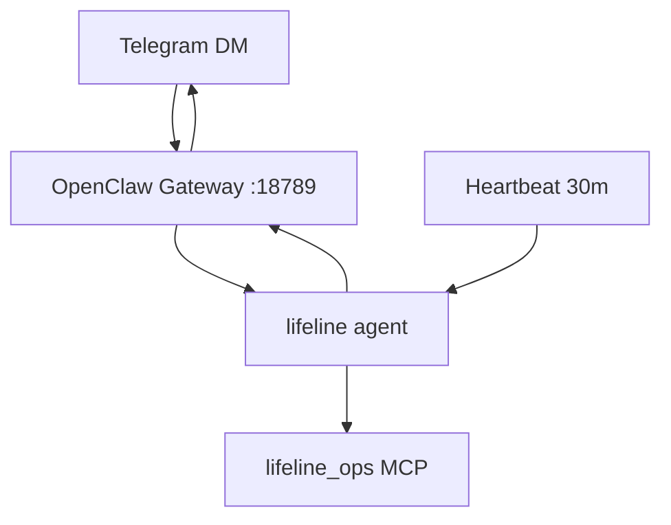

# LifeLine Telegram bot (OpenClaw)

LifeLine uses **OpenClaw Gateway** for bidirectional Telegram chat. Direct messages talk to the `lifeline` agent; subscriptions control push alerts and daily plans.

## Architecture



| Surface | Direction | Use |
|---------|-----------|-----|
| Plain text DM | Bidirectional | Ask anything — no slash commands needed |
| `/subscribe_alerts` | Command → flag | Heartbeat pushes disruption alerts |
| `/subscribe_daily` | Command → flag | Morning digest (backend orchestrated) |

> Only **one** process should long-poll Telegram `getUpdates` — the OpenClaw gateway.

---

## Quick start

### 1. Bot token

1. Message [@BotFather](https://t.me/BotFather) → `/newbot` → save token.
2. Add to `.env` (never commit):

```bash
TELEGRAM_BOT_TOKEN=123456789:ABCdef...
# optional — skip pairing:
# TELEGRAM_ALLOW_FROM=8734062810
```

### 2. Configure + start

```bash
cd /home/nvidia/NV-Disruptron-Alex
./scripts/start_vllm_backend.sh          # if not running
./scripts/configure_nemoclaw_lifeline.sh
./scripts/configure_channels_lifeline.sh
openclaw gateway restart
```

Or full stack:

```bash
./features/agent-autonomous/scripts/start_lifeline_stack.sh
```

### 3. Pair (default `dmPolicy: pairing`)

```bash
# DM your bot once, then:
openclaw pairing list telegram
openclaw pairing approve telegram <CODE>
```

### 4. Verify

```bash
openclaw channels status --probe
openclaw logs --follow
```

Message the bot: *"How's London transport right now?"*

---

## Subscription commands

| Command | Effect |
|---------|--------|
| `/subscribe_alerts` | Push text alerts on material transport changes |
| `/unsubscribe_alerts` | Stop alerts |
| `/subscribe_daily` | Morning daily plan digest (~08:00 London) |
| `/unsubscribe_daily` | Stop daily plan |

Preferences persist in `features/agent-autonomous/workspace/memory/telegram-subscriptions.json`.

---

## Config reference

Patched into `~/.openclaw/openclaw.json` by `configure_channels_lifeline.sh`:

```json
{
  "bindings": [
    { "agentId": "lifeline", "match": { "channel": "telegram" } }
  ],
  "channels": {
    "telegram": {
      "enabled": true,
      "botToken": "<from .env>",
      "dmPolicy": "pairing",
      "groups": { "*": { "requireMention": true } },
      "streaming": "partial"
    }
  }
}
```

### Environment variables

| Variable | Required | Purpose |
|----------|----------|---------|
| `TELEGRAM_BOT_TOKEN` | Yes | BotFather token |
| `TELEGRAM_ALLOW_FROM` | Optional | Numeric user id — skip pairing |
| `TELEGRAM_DM_POLICY` | Optional | `pairing` (default) or `allowlist` |
| `TELEGRAM_GROUP_ID` | Optional | Supergroup id for ops channel |

---

## Troubleshooting

| Issue | Fix |
|-------|-----|
| Bot silent | `openclaw channels status --probe`; check token in `.env` |
| Pairing required | `openclaw pairing approve telegram <CODE>` |
| Context overflow | Fresh session; keep `NEMOCLAW_SLIM_MCP=true` |
| Group ignores bot | `requireMention: true` — @mention the bot |

See [OpenClaw Telegram docs](https://docs.openclaw.ai/channels/telegram).
