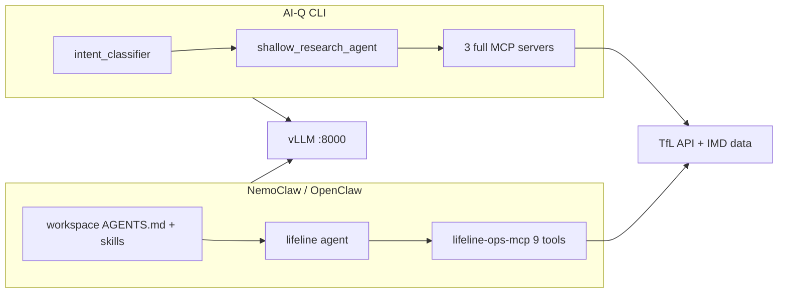

# LifeLine Grid — full documentation index

Central reference for **NV-Disruptron** (Hack for Impact London 2026, Urban Operations).

## Quick links

| Doc | Contents |
|-----|----------|
| [../README.md](../README.md) | Project overview, architecture, MCP tools, AI-Q, vLLM |
| [README.md](README.md) | NemoClaw / OpenClaw autonomous agent |
| [CHANNELS.md](CHANNELS.md) | Telegram + multi-channel setup |
| [workspace/skills/README.md](workspace/skills/README.md) | Skill catalog + example prompts |
| [../lifeline/README.md](../lifeline/README.md) | AI-Q prompts + CLI path |
| [../lifeline/prompts/](../lifeline/prompts/) | Jinja templates for AI-Q |

## Two agent runtimes



| | AI-Q | NemoClaw |
|--|------|----------|
| **Start** | `scripts/start_lifeline.sh` | `scripts/start_nemoclaw_lifeline.sh` |
| **Best for** | Interactive Q&A, cited answers | Autonomous monitor + recommended next steps |
| **Prompts** | `lifeline/prompts/*.j2` | `nemoclaw/workspace/AGENTS.md` + skills |
| **MCP** | 45 tools (3 servers) | 9 tools (slim) or 45 (full) |

## Scripts reference

| Script | Purpose |
|--------|---------|
| `scripts/start_lifeline.sh` | vLLM + AI-Q CLI |
| `scripts/start_nemoclaw_lifeline.sh` | vLLM + configure + OpenClaw TUI |
| `scripts/configure_nemoclaw_lifeline.sh` | MCP registration, workspace, model |
| `scripts/start_vllm_backend.sh` | Docker vLLM on :8000 |
| `scripts/monitor_lifeline.sh` | Health dashboard (`--watch`, `--json`) |
| `scripts/validate_lifeline.sh` | MCP + data smoke test |
| `scripts/test_aiq_lifeline.sh` | AI-Q London query test |
| `scripts/test_nemoclaw_lifeline.sh` | Autonomous agent smoke test |
| `scripts/test_parking_charging.sh` | EV + car park MCP (no LLM) |
| `scripts/test_lifeline_skills.sh` | Verify all SKILL.md files present |
| `scripts/configure_channels_lifeline.sh` | Telegram + bindings + heartbeat |
| `scripts/start_lifeline_stack.sh` | vLLM + full NemoClaw + channels |
| `scripts/test_analysis_pipeline.sh` | Snapshot → metrics feedback loop |

## MCP servers

| Server | Path | Tools (approx) |
|--------|------|----------------|
| TfL London | `tfl-mcp-server/` | 31 — live transport, roads, EV, car parks |
| London Spatial | `london-spatial-mcp/` | 7 — wards, IMD, geocoding |
| London Impact | `london-impact-mcp/` | 7 — briefing, equity scoring |
| LifeLine Ops (slim) | `lifeline-ops-mcp/` | 9 — NemoClaw subset |

**Start here (any runtime):** `get_london_city_briefing`

### TfL API status (verified)

| Endpoint | Status |
|----------|--------|
| `Occupancy/ChargeConnector` | ✅ live |
| `Place/Type/CarPark` | ✅ metadata |
| `Occupancy/CarPark` | ❌ HTTP 500 |
| `Road/all/Street/Disruption` | ✅ with date params |

## NemoClaw workspace layout

```
nemoclaw/workspace/
├── AGENTS.md          # Autonomous ops loop (every session)
├── SOUL.md            # Persona
├── TOOLS.md           # MCP reference
├── HEARTBEAT.md       # Monitor checklist
├── USER.md            # Project context
└── skills/
    ├── README.md
    ├── lifeline-ops/
    ├── lifeline-monitor/
    ├── lifeline-tube/
    ├── lifeline-roads/
    ├── lifeline-parking-charging/
    ├── lifeline-equity/
    └── lifeline-spatial/
```

## Configuration

| Variable | Default | Purpose |
|----------|---------|---------|
| `VLLM_SERVED_MODEL` | `nemotron_3_nano_omni` | Model id at :8000 |
| `LIFELINE_PROMPTS_DIR` | `lifeline/prompts` | AI-Q prompt override |
| `NEMOCLAW_WORKSPACE` | `nemoclaw/workspace` | OpenClaw workspace |
| `NEMOCLAW_SLIM_MCP` | `true` | 9-tool vs full MCP catalog |
| `TFL_APP_KEY` | (optional) | Higher TfL rate limits |

OpenClaw config: `~/.openclaw/openclaw.json` (patched by `configure_nemoclaw_lifeline.sh`)

## Example end-to-end flows

### 1. Hackathon demo (autonomous)

```bash
openclaw agent --local --agent lifeline \
  -m "Monitor London transport. Use live tools. Top 3 investigations."
```

Expected: briefing → triage → **Situation / Impact / Evidence / Recommended actions**

### 2. Equity deep-dive

```bash
openclaw agent --local --agent lifeline \
  -m "Jubilee line delays — which deprived wards are worst affected?"
```

Expected: `score_line_disruption_impact(jubilee)` + ward IMD context

### 3. AI-Q interactive

```bash
./scripts/start_lifeline.sh
# > How's stuff in London rn?
```

Expected: `london_impact__get_london_city_briefing` + cited answer

## Troubleshooting

| Symptom | Fix |
|---------|-----|
| Context overflow (OpenClaw) | Keep `NEMOCLAW_SLIM_MCP=true`; fresh `--session-id` |
| Tool "isn't available" | `configure_nemoclaw_lifeline.sh` + gateway restart |
| Generic chat (AI-Q) | Check `LIFELINE_PROMPTS_DIR`; London → research intent |
| vLLM down | `./scripts/start_vllm_backend.sh` |
| Skills not loading | `openclaw skills list`; restart gateway; `/new` session |
