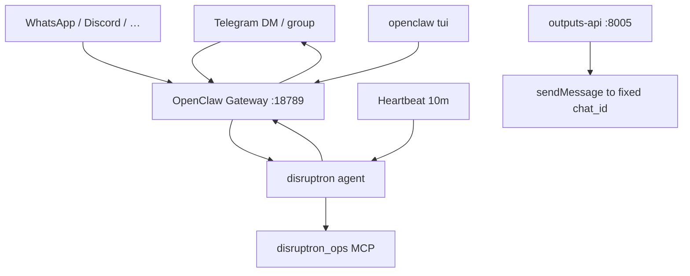

# NV-Disruptron multi-channel setup (Telegram, alerts, etc.)

NV-Disruptron runs on **OpenClaw** for interactive channels and optional **outputs-api** for one-way alerts.

## Architecture



| Path | Direction | Use |
|------|-----------|-----|
| **OpenClaw `channels.telegram`** | Bidirectional | Ops bot — user asks, agent tools + replies |
| **outputs-api** | One-way push | Alerts to a fixed `TELEGRAM_CHAT_ID` from code/CI |

> Only **one** process should long-poll Telegram `getUpdates` — use OpenClaw gateway for the interactive bot.

---

## Quick start: Telegram

### 1. Create bot

1. Message [@BotFather](https://t.me/BotFather) on Telegram.
2. `/newbot` → save the **bot token**.
3. Get your **numeric user id** (e.g. [@userinfobot](https://t.me/userinfobot)).

### 2. Configure (no token in git)

```bash
export TELEGRAM_BOT_TOKEN="123456789:ABCdef..."
export TELEGRAM_ALLOW_FROM="8734062810"   # optional; omit for pairing flow

/home/nvidia/NV-Disruptron-Gyana/platform/delivery/scripts/configure_channels_disruptron.sh
openclaw gateway restart
```

### 3. Pair (if using pairing mode)

```bash
# DM your bot once, then:
openclaw pairing list telegram
openclaw pairing approve telegram <CODE>
```

### 4. Verify

```bash
openclaw channels status --probe
openclaw logs --follow
```

Message the bot: *"Monitor London and tell me what to investigate next"*

---

## Config reference

Patched into `~/.openclaw/openclaw.json` by `configure_channels_disruptron.sh`:

```json
{
  "bindings": [
    { "agentId": "disruptron", "match": { "channel": "telegram" } }
  ],
  "channels": {
    "telegram": {
      "enabled": true,
      "botToken": "<from env>",
      "dmPolicy": "allowlist",
      "allowFrom": ["tg:8734062810"],
      "groups": { "*": { "requireMention": true } },
      "streaming": "partial"
    }
  },
  "agents": {
    "list": [{
      "id": "disruptron",
      "default": true,
      "heartbeat": {
        "every": "30m",
        "target": "last",
        "lightContext": true,
        "isolatedSession": true
      }
    }]
  }
}
```

### Group chat (optional)

```bash
export TELEGRAM_GROUP_ID="-1001234567890"
./scripts/disruptron configure --channels
```

Add bot to group; mention `@your_bot` to trigger (`requireMention: true`).

### Environment variables

| Variable | Required | Purpose |
|----------|----------|---------|
| `TELEGRAM_BOT_TOKEN` | For Telegram | BotFather token |
| `TELEGRAM_ALLOW_FROM` | Recommended | Numeric user id — skip pairing |
| `TELEGRAM_GROUP_ID` | Optional | Supergroup id for ops channel |

---

## Agentic engineering (what we implemented)

Based on 2025–2026 production agent patterns:

| Pattern | Implementation |
|---------|----------------|
| **Bounded loop** | `shared/disruptron_agent_policy.py` — max 8 steps, 2 calls/tool/turn |
| **Tool-first** | Briefing before synthesis; skills per domain |
| **Slim MCP surface** | 9–10 tools (`platform/mcp/ops`) — fits 16k context |
| **Skills as markdown** | Progressive disclosure via `skills/*/SKILL.md` |
| **Heartbeat** | 30m isolated session + `HEARTBEAT.md` thresholds |
| **Channel formatting** | `disruptron-channel-reply` skill — mobile-friendly |
| **Health observability** | `disruptron_ops__get_disruptron_ops_health` |
| **Session isolation** | `session.dmScope: per-channel-peer` |

---

## One-way alerts (outputs-api)

For push-only notifications (monitor script, CI):

```bash
export TELEGRAM_BOT_TOKEN="..."
export TELEGRAM_CHAT_ID="-100..."   # or your user id for DMs
./scripts/start_outputs_api.sh
curl -X POST http://127.0.0.1:8005/v1/outputs -H 'Content-Type: application/json' \
  -d '{"channel":"telegram","message":"NV-Disruptron: 3 tube lines disrupted"}'
```

**Google Calendar** (shared OAuth with AI-Q — run `./scripts/setup_google_calendar.sh` first):

```bash
curl -X POST http://127.0.0.1:8005/v1/outputs -H 'Content-Type: application/json' \
  -d '{"channel":"google_calendar","title":"NV-Disruptron alert","message":"3 tube lines disrupted"}'
curl http://127.0.0.1:8005/v1/calendar/events?max=5
```

See [../../delivery/docs/GOOGLE_CALENDAR.md](../../delivery/docs/GOOGLE_CALENDAR.md).

Use a **different bot** or only outputs-api if OpenClaw gateway is not running Telegram.

---

## Other OpenClaw channels

Same `disruptron` binding pattern — add channel block + binding:

```json
{ "agentId": "disruptron", "match": { "channel": "whatsapp" } }
```

See [OpenClaw channel docs](https://docs.openclaw.ai/channels) for WhatsApp, Discord, Slack, Signal.

---

## Troubleshooting

| Issue | Fix |
|-------|-----|
| Bot silent | `openclaw channels status --probe`; check token |
| Pairing required | `openclaw pairing approve telegram <CODE>` |
| Context overflow | Use `--agent disruptron` + fresh session; keep slim MCP |
| Group ignores bot | `requireMention: true` — @mention the bot |
| IPv6 VPS issues | Force IPv4 egress to `api.telegram.org` |
