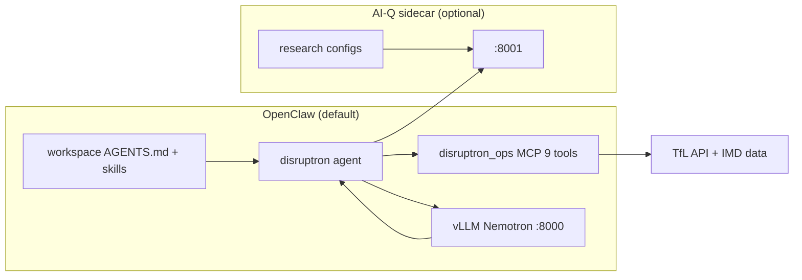

# NV-Disruptron — full documentation index

Central reference for **NV-Disruptron** (Hack for Impact London 2026, Urban Operations).

## Quick links

| Doc | Contents |
|-----|----------|
| [../../../README.md](../../../README.md) | Project overview |
| [../../../docs/INDEX.md](../../../docs/INDEX.md) | Full documentation map |
| [../../../docs/ENGINEERING.md](../../../docs/ENGINEERING.md) | Change workflow |
| [../README.md](../README.md) | Agent quick start |
| [CHANNELS.md](CHANNELS.md) | Telegram + outputs-api |
| [../workspace/skills/README.md](../workspace/skills/README.md) | Skill catalog |
| [../research/README.md](../research/README.md) | AI-Q sidecar path |
| [../research/prompts/](../research/prompts/) | Jinja templates |

## Runtime architecture



| | OpenClaw (default) | AI-Q sidecar |
|--|-------------------|--------------|
| **Start** | `./scripts/disruptron run` | Auto with run; or manual on `:8001` |
| **Best for** | 24/7 monitor, voice, vision, Telegram | Long-form cited research reports |
| **Prompts** | `workspace/AGENTS.md` + skills | `research/prompts/*.j2` |
| **MCP** | 9 tools (slim) or 45 (full) | 45 tools (3 servers) |

## Scripts reference

| Script | Purpose |
|--------|---------|
| `./scripts/disruptron daemon` | 24/7 vLLM + gateway + heartbeat + alerts |
| `./scripts/disruptron run` | Interactive TUI (+ `--channels` for Telegram) |
| `./scripts/disruptron query "…"` | One-shot query |
| `./scripts/disruptron vllm` | Docker vLLM on :8000 |
| `./scripts/disruptron monitor` | Health dashboard |
| `./scripts/disruptron validate` | MCP + data smoke test |
| `./scripts/disruptron configure` | MCP + OpenClaw + TTS registration |
| `./scripts/disruptron test agent` | Live OpenClaw agent smoke (needs vLLM) |
| `./scripts/disruptron test transport` | EV + car park MCP (no LLM) |
| `./scripts/disruptron test skills` | Verify all SKILL.md files |
| `./scripts/disruptron test analysis` | Snapshot → metrics feedback loop |

## MCP servers

| Server | Path | Tools |
|--------|------|-------|
| TfL Transport | `platform/mcp/transport/` | 31 |
| London Spatial | `platform/mcp/spatial/` | 7 |
| London Impact | `platform/mcp/impact/` | 7 |
| Disruptron Ops | `platform/mcp/ops/` | 9 |

**Start here (any runtime):** `disruptron_ops__get_london_city_briefing`

### TfL API status (verified)

| Endpoint | Status |
|----------|--------|
| `Occupancy/ChargeConnector` | live |
| `Place/Type/CarPark` | metadata |
| `Occupancy/CarPark` | HTTP 500 |
| `Road/all/Street/Disruption` | with date params |

## Agent workspace layout

```
features/agent/workspace/
├── AGENTS.md          # Autonomous ops loop (every session)
├── SOUL.md            # Persona
├── TOOLS.md           # MCP reference
├── HEARTBEAT.md       # Monitor checklist
├── USER.md            # Private mobility profile
├── VOICE.md           # TTS privacy rules
└── skills/
    ├── README.md
    ├── disruptron-proactive-alert/
    ├── disruptron-ev-companion/
    ├── disruptron-voice/
    ├── disruptron-vision-browser/
    ├── disruptron-ops/              # all disruptron-branded
    └── …
```

## Configuration

| Variable | Default | Purpose |
|----------|---------|---------|
| `VLLM_SERVED_MODEL` | `nemotron_3_nano_omni` | Model id at :8000 |
| `DISRUPTRON_WORKSPACE` | `features/agent/workspace` | OpenClaw workspace |
| `DISRUPTRON_HEARTBEAT_EVERY` | `10m` | Autonomous scan interval |
| `DISRUPTRON_SLIM_MCP` | `true` | 9-tool vs full MCP catalog |
| `VLLM_MULTIMODAL` | `0` | Enable audio/image in vLLM |
| `TFL_APP_KEY` | (optional) | Higher TfL rate limits |
| `ELEVENLABS_API_KEY` | (optional) | Voice in/out |

OpenClaw config: `~/.openclaw/openclaw.json` (patched by `disruptron configure`)

## Example end-to-end flows

### 1. Hackathon demo (autonomous)

```bash
./scripts/disruptron daemon
# or one-shot:
openclaw agent --local --agent disruptron \
  -m "Monitor London transport. Use live tools. Top 3 investigations."
```

Expected: briefing → triage → **Situation / Impact / Evidence / Recommended actions**

### 2. Equity deep-dive

```bash
openclaw agent --local --agent disruptron \
  -m "Jubilee line delays — which deprived wards are worst affected?"
```

Expected: line disruption tools + ward IMD context

### 3. Interactive + voice

```bash
./scripts/disruptron run
# Talk Mode on OpenClaw mobile app, or send voice note
```

## Troubleshooting

| Symptom | Fix |
|---------|-----|
| Context overflow (OpenClaw) | Keep `DISRUPTRON_SLIM_MCP=true`; fresh `--session-id` |
| Tool "isn't available" | `./scripts/disruptron configure` + gateway restart |
| vLLM down | `./scripts/disruptron vllm --recreate` |
| Skills not loading | `openclaw skills list`; restart gateway; `/new` session |
| outputs-api missing | `make setup` (syncs `platform/delivery/outputs-api`) |
